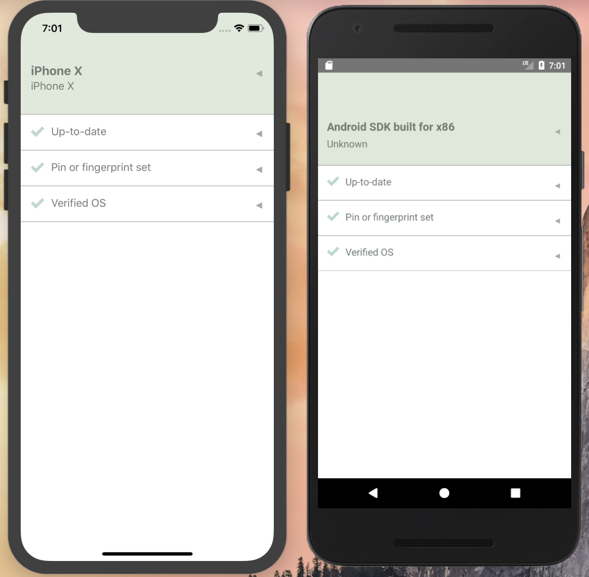

# Stethoscope Mobile App

[](https://gitter.im/Netflix-Stethoscope/Lobby?utm_source=badge&utm_medium=badge&utm_campaign=pr-badge&utm_content=badge) [](http://www.apache.org/licenses/LICENSE-2.0) []()

<center>

</center>

The Stethoscope Mobile App is a native mobile application created by Netflix that checks security-related settings and makes recommendations for improving the configuration of your Android or iOS device. This project is currently in an experimental / proof of concept phase. We hope to eventually introduce this app to our employees and partners, but we've decided to open source it in the meantime as there has been a lot of interest in the idea from the community. We would love to hear from you if you've been working on something similar or would like to collaborate!

Opening the app will run a quick check of your device configuration and present recommendations and instructions.

It does not automatically report device status to a central server, but can be configured to allow requests via incoming app links from particular web pages. This approach enables data collection and device-to-user mapping when people access certain web applications or go through integrated web authentication flows.

The Stethoscope Mobile App is built using [React Native](https://facebook.github.io/react-native/), [React Native Device Info](https://github.com/react-native-community/react-native-device-info), [Jail Monkey](https://www.npmjs.com/package/jail-monkey) and [GraphQL](https://graphql.org/).

Getting Started
---------------

Setup your development environment by installing the React Native CLI, setting up Xcode and Android Studio. Follow the instructions given at [React Native Getting Started page](https://facebook.github.io/react-native/docs/getting-started.html). Use the instructions given in the "React Native CLI Quickstart" tab up until the "Creating a new application" step. If you would like to target both iOS and Android be sure to complete the setup under both Target OS iOS and Android. 

Clone this repository and install dependencies: 
```
git clone this repo. 
yarn install
```

Link the dependencies that require native code: 
```
react-native link
```
You can read more about linking libraries in the React Native [Linking Libraries Documentation](https://facebook.github.io/react-native/docs/linking-libraries-ios).

To start the iOS app and launch the iPhone emulator: 
```
react-native run-ios
```

To start the Android app, open Android Studio, launch an Emulator open Tools > AVD Manager and start one of the emulators. If no emulators are found you can create one by clicking: "Create Virtual Device...". Once the emulator is running back in the terminal run: 
```
react-native run-android
```

Configuring Device Checks and Instructions
-------------------------------------------

The app is built with a default policy, which specifies recommended OS versions and security settings: pin / fingerprint is set, and the OS is verified (not jailbroken). When you open the app without a specififed query and policy in the app link it will run the default device query and policy. 

You can update the policy guidelines (OS versions, required settings, etc.) in [constants.js](constants.js), and change the instructions in [instructions.js](instructions.js).

[Learn more about queries and policies](docs/QUERIES_AND_POLICIES.md)

Data collection and reporting
-----------------------------

Rather than automatically reporting to a central server or a mobile device management solution, data from the Stethoscope Mobile app can be requested in client side JavaScript from allowed web pages. An example on how to collect device data can be found [here](docs/DEVICE_COLLECTION.md).

More About Stethoscope
----------------------

You can read more about the evolution of Stethoscope and the Philosophy behind Stethoscope in our blog posts and other repos: 

* [Netflix Tech blog post about the Stethoscope Native app for Mac, Windows and Linux](https://medium.com/netflix-techblog/the-new-netflix-stethoscope-native-app-f4e1d38aafcd)
* [Repo for the Stethoscope Native app for Mac, Windows and Linux](https://github.com/Netflix-Skunkworks/stethoscope-app)
* [Netflix Tech blog post about Stethoscope Web](https://medium.com/netflix-techblog/introducing-netflix-stethoscope-5f3c392368e3) 
* [Repo for Stethoscope Web](https://github.com/Netflix-Skunkworks/stethoscope)

Contact
-------

You can reach the Stethoscope development team at [stethoscope@netflix.com](mailto:stethoscope@netflix.com) and via our [Gitter](https://gitter.im/Netflix-Stethoscope/Lobby).
