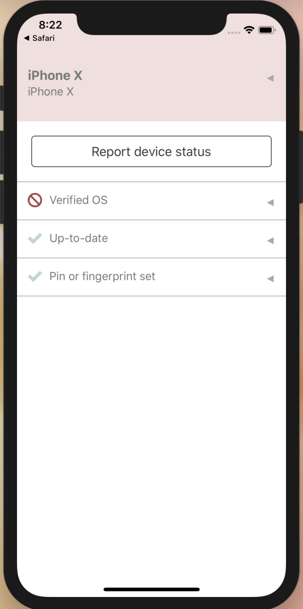

# Stethoscope Mobile App Device Information Collection

The Stethoscope Mobile app allows predefined sites to request information about a device via the app link. 
Allowed sites are defined in [constants.js](../constants.js#L1-L5). 

Requesting Device Information
-----------------------------
To request information about the device the app can be opened with an app link that includes a base 64 encoded request for information.  
The app link is defined as `stethoscope://`
The request for information can be constructed as follows: 
```
var appParameters = {
    r: window.location.href, 
    q: 'query ValidateMobileDevice($policy: MobileDevicePolicy!) { mobileDevice { deviceId deviceName platform, osVersion, hardwareModel, hardwareSerial, manufacturer, brand, stethoscopeVersion, deviceLocale, deviceCountry, security { osVersion pinOrFingerprintSet verifiedOs } } policy { validateWithDetails(policy: $policy) { status osVersion pinOrFingerprintSet verifiedOs } } }', 
    p: '{"policy":{"osVersion":{"ios":">=11.0", "android":">=8.0.0"},"pinOrFingerprintSet":"ALWAYS","verifiedOs":"ALWAYS"}}'
};
var scopeAppLink = "stethoscope://"+btoa(JSON.stringify(appParameters));
```

In the encoded JSON sent with the app link the following three parameters must be included: 
* **r:** Return url where the app will re-open with the device query response. Generally this will be the location of the current window. 
* **q:** Query, this is a GraphQL query that contains the information about the device that you would like to receive back. 
* **p:** Policy, this is a JSON defined policy that describes the desired state of a device.

When the app opens with a valid request for information, it will execute the incoming query and policy, and display a Report device status button. 

<center>

</center>

Receiving Device Information
----------------------------
When a user presses the Report device status button upon recieving a request for device information the Stethoscope app will open the provided return url along with a `#deviceInfo=` hash parameter. The hash parameter's value is a base64 encoded JSON response containing the requested device information and status. See more in the [queries and policies](./QUERIES_AND_POLICIES.md) documentation about the response.

Example
-------
An example of requesting and receiving device information can be found in [/example-app-link](../example-app-link/).

It contains a simple server which can run with `node example-app-link/server.js` then reached on iOS at: `http://127.0.0.1:8080` and on Android at: `http://10.0.2.2:8080`. It serves the static [index.html](../example-app-link/index.html) which generates a link to request device information and decodes device information that it receives back. 